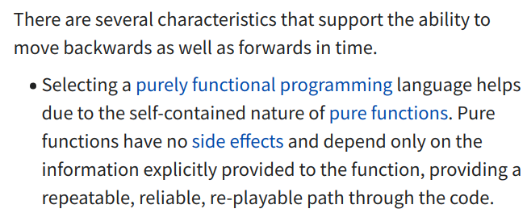
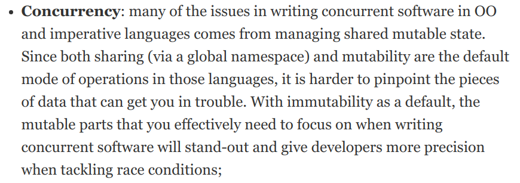

Benefits of Pure Functions
--------------------------


### Referential Transparency (1/3)

* Wow, nosebleed!
  - An expression is called referentially transparent if it can be replaced with its corresponding 
    value without changing the program's behavior.
  - Did I mention FP is based on Math (lambda calculus)?
* $ x = 37 + sin(30) $
  - $ sin(30) $ can be replaced by its value 0.5 without changing **x**

```js
const add = (x, y) => Number(x) + Number(y);
add(3, 4) * add(9, add(7, -2)); // 98
add(3, 4) * add(9, 5); // 98
7 * 14 // 98
```


### Referential Transparency (2/3)

* Side-effects break referential transparency
  - different output/behavior after replacement

```js
function round(number, places) {
  // impure due to this I/O operation
  console.log(`Rounding off ${number} to ${places} places.`);
  const multiplier = 10 ** places;
  return Math.round(number * multiplier) / multiplier;
}

console.log(3 + round(74.925, 2))
// Rounding off 74.925 to 2 places.
// 77.93

console.log(3 + 74.93)
// 77.93    👈 only, different behavior
```


### Referential Transparency (3/3)

* Mutations break referential transparency
  - different output/behavior after replacement

```js []
function paintRed(car) {
  car.color = 'red';
  return car;
}

const wigo = { model: 'Toyota Wigo', color: 'silver' };
const retouched = { model: 'Toyota Wigo', color: 'red' };
wigo.model = 'Toyota Wigo 2020';
console.log('wigo retouched', retouched);
```

<pre style="font-size: 0.5em">
// The original code produces:
wigo retouched { model: 'Toyota Wigo 2020', color: 'red' } (1)

// Replacing line 6 with `{ model: 'Toyota Wigo', color: 'red' }`
wigo retouched { model: 'Toyota Wigo', color: 'red' } (2)
</pre>


### ~~Math~~Referential transparency is all about safe substitutions

```js []
function paintRed(car) {
  return { ...car, color: 'red' };
}

const wigo = { model: 'Toyota Wigo', color: 'silver' };
const retouched = paintRed(wigo);
wigo.model = 'Toyota Wigo 2020';
console.log('wigo retouched', retouched);
```

<pre>
// The original code produces:
wigo retouched { model: 'Toyota Wigo', color: 'red' } (1)

// Replacing line 6 with `{ model: 'Toyota Wigo', color: 'red' }`
wigo retouched { model: 'Toyota Wigo', color: 'red' } (2)
</pre>

* Our program behavior **did not change**


### Testability

* Pure functions are easier to test
  - Second lesson in SE-2124 (2nd subterm) is unit testing
* Tests have 3 parts:
  - input
  - expected output (GGEZ with pure functions)
  - actual output (run the functionn and see what it yields)
* 3 parts sample for `round()`:
  - input is `(74.995, 2)`, expected output always **75**
  - input is `(74.925, 2)`, expected output always **74.93**
  - input is `(74.925, 1)`, expected output always **74.9**


### Easier to reason and debug

* Less things to worry about (vars don't change)
* Easy to debug as a result
* Easy to maintain
* FP also works well with time-travelling debuggers\

[](https://en.wikipedia.org/wiki/Time_travel_debugging)


### Deterministic Concurrency (1/2)


### Deterministic Concurrency (2/2)

[](http://blog.plataformatec.com.br/2016/05/beyond-functional-programming-with-elixir-and-erlang/)

* Elixir's concurrency is awesome, and it's FP
  - [Discord is one of the notable Elixir users](https://blog.discord.com/scaling-elixir-f9b8e1e7c29b)


### Memoization

* Since pure functions always return the same value given the same argument:
  - we can memo~~r~~ize slow computations (remember: no **R**)
    + e.g. `fibonacci`, linear search a very large list

<iframe width="560" height="315" src="https://www.youtube.com/embed/WbwP4w6TpCk" frameborder="0" allow="accelerometer; autoplay; clipboard-write; encrypted-media; gyroscope; picture-in-picture" allowfullscreen></iframe>