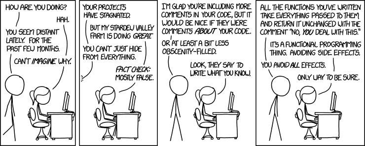

Pure Functions and Immutability
-------------------------------

<small>
  <span style="color: darkblue;">&lt;</span><span style="color: goldenrod;">/&gt;</span>
  <a href="https://github.com/psse-cpu/se2123-pure-functions-slides">
    https://github.com/psse-cpu/se2123-pure-functions-slides
  </a>
</small>

<h4 style="margin-top: 192px; font-size: 0.85em;">
  <span class="course-code">SE 2123</span>
  <span class="course-title">Software Development III</span>
</h4>

<div style="font-size: 0.75em; margin-top: 16px;">
  <b>Richard Michael Coo</b> |

  <a href="https://github.com/myknbani">
    
  </a>
  <a href="https://twitter.com/myknbani">
    
  </a>
  <span style="vertical-align: middle">@myknbani</span>
</div>


### Outline

- pure functions
- immutability
- functions vs procedures (impure functions)
- benefits
  + referential transparency
  + testability
  + easier to reason about and debug
    * [time-travel debugging](https://en.wikipedia.org/wiki/Time_travel_debugging)
  + concurrency
  + memoization and caching


### Pure Functions

- always return the same output given the same input
- no mutations, no side-effects (e.g. I/O, etc.)


### Side Effects



- this is what FP strives for
  * pure FP languages such as Haskell and Purescript isolate side-effects using Monads


### Examples of Side Effects

* Modifying any external variable or object property 
  - e.g. global variable, parameters
* Logging to the console
* Writing to the screen
* Writing to a file
* Writing to the network
* Triggering any external process
* Calling any other functions with side-effects


### Examples of pure functions

```js
> Math.sin(Math.PI / 6)
0.49999999999999994
> Math.sin(Math.PI / 6)
0.49999999999999994

> Math.log10(100000)
5
> Math.log10(100000)
5

> parseInt('1001', 2)
9
> parseInt('1001', 2)
9
```

Always returns the same output given the same input


### Examples of impure functions

```js
> Math.random(undefined)
0.7396948156712178
> Math.random(undefined)
0.08775785377536138
> Math.random(undefined)
0.5972502289422579

> Date.now(undefined)
1600103519394
// three seconds later
> Date.now(undefined)
1600103522856
```

* no-args functions actually does not take any parameters (`undefined`)
  - but illustrates the point, same input, different output


### Examples: non-built-ins

```js
function add(x, y) {
  return Number(x) + Number(y);
}

> add(3, 4)
7
> add(30, '5')
35
> add(30, '5')
35
> add(3, 4)
7
```

* Same pair of input always yield the same output
  - conversion to `Number` is just for sanity


### Examples: mutating an external var

```js
let sum = 0

function add(x, y) {
  sum = Number(x) + Number(y);
  return sum;
}

add(3, 4);
console.log('sum is ' + sum);
sum = 100;
add(3, 4)
console.log('sum is ' + sum)
```

* The function now mutates an external variable
  - that's a side-effect, function is impure


### Examples: ~~objects~~POJOs

```js
function paintSilverPure(car) {
  return { ...car, color: 'silver' };
}

function paintRedImpure(car) {
  car.color = 'red';
}
```

```js
const car = { model: 'Toyota Wigo', color: 'blue' };
paintRedImpure(car);
console.log('mutated car: ', car); 
// mutated car:  { model: 'Toyota Wigo', color: 'red' }

const silverVersion = paintSilverPure(car);
console.log('intact red car: ', car); 
// intact red car:  { model: 'Toyota Wigo', color: 'red' }
console.log('silver version: ', silverVersion); 
// silver version:  { model: 'Toyota Wigo', color: 'silver' }
```


### Examaples:  I/O

```js
function round(number, places) {
  // impure due to this I/O operation
  console.log(`Rounding off ${number} to ${places} places.`);
  const multiplier = 10 ** places;
  return Math.round(number * multiplier) / multiplier;
}
```

```js
Rounding off 55.329 to 1 places.
55.3
> round(55.329, 2)
Rounding off 55.329 to 2 places.
55.33
> round(55.329, 0)
Rounding off 55.329 to 0 places.
55
> round(55.329, 1)
Rounding off 55.329 to 1 places.
55.3
```
